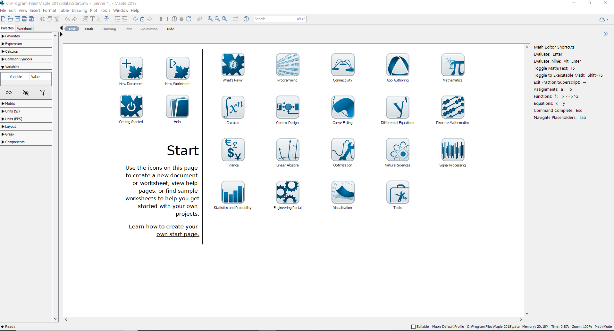
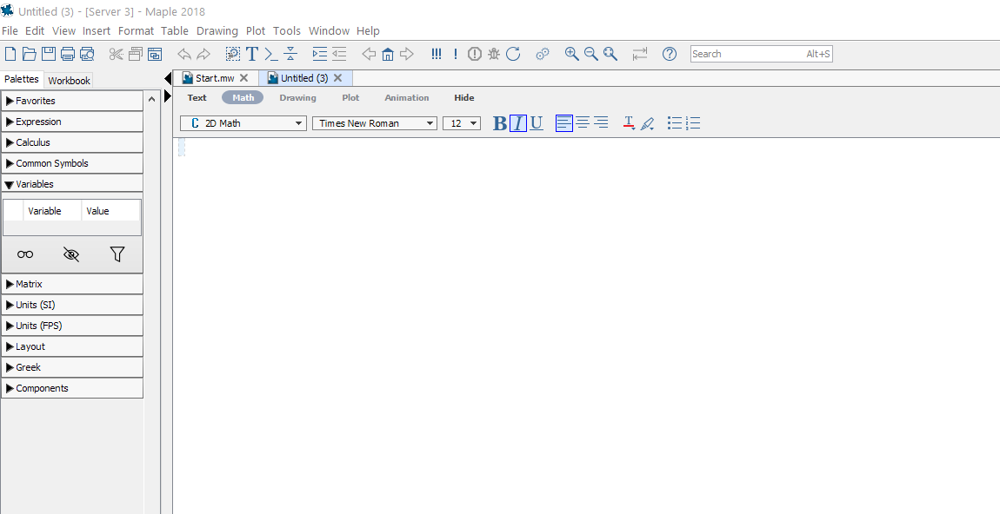
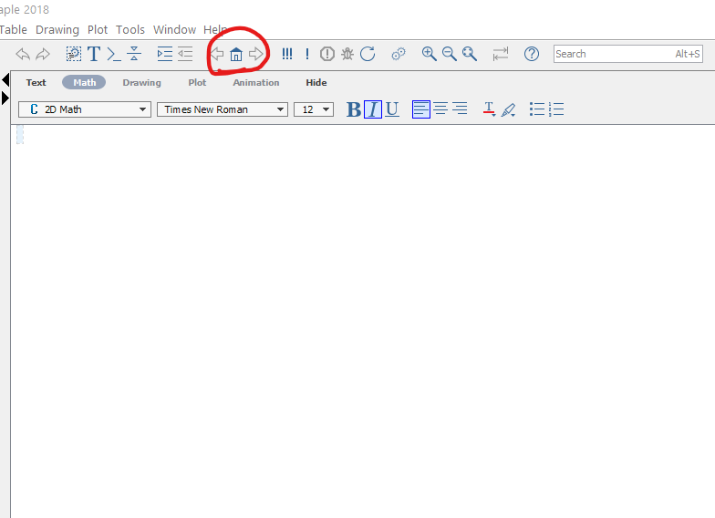
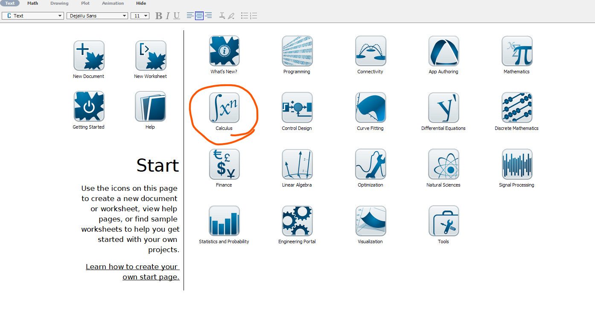

# Basics in Maple

## What should I do after I opened Maple

Once you opened Maple, you will see the following Maple Start document.



- If you already know what you want to do, then you may open a new document by clicking `New Document` icon in the start document. The following shows what an new (empty document) looks like.



In this new document you may type in text under `Text` mode or evaluate a Maple syntax in the `Math` mode. (See the following picture).


- If you want to explore some featured sample documents, you may go to `Start.mw` document and click on different icons to open a new document. 

  - You may alway reopen the start page by click the home icon to reopen the start page.
  
  

- For Calculus, the most useful document is `Calculus`.



If you click the `Calculus` icon on the Start page and click `OK`, you will see the following document.


## Basic Operators

The first thing to know when learn something new is where and how to get help. In Maple, you may simply type

```

?keyword

```

to open a help page (a new window).

For example, the command `?operators` will lead you to descriptions of arithmetic operators in Maple.

| | addition | subtraction | multiplication | division | exponentiation |
|:---:|:---:|:---:|:---:|:---:|:---:|
| Maple Operators | `+` | `-` | `*` | `/` | `^` |
| In writing | $x+2$ | $a-b$ | $2x$ | $\dfrac pq$ | $b^5$ |
| In Maple| `x+2` | `a-b` | `2*x` | `p/q` | `b^5` |

## How to define a function

A function is an assignment, for a given input $x$, we assignment an output $y$ under a certain rule. Maple take this idea to define functions. The command to define a function has the following form.

```

function name:= independent variable -> function rule

```

Here `:=` means "defined/assigned to be" and `->` may be understood as "plug in".

```{example}

Define the following function in Maple and find the value $f(0.999)$.

$$
f(x)=\dfrac{x}{x-1}
$$

```

```{solution}
The function name is $f$, the independent variable is $x$ and the function rule is $\dfrac{x}{x-1}$. So the function can be defined in Maple by the following command.

    f:=x->x/(x-1)

Once the function is define, you may find the function value by the command `f(0.999)`.

```

```{exercise}

Define the following function in Maple and find the value $f(2.0001)$.

$$
g(x)=\dfrac{x^3}{(x-2)^2}
$$

```

```{remark}

The assignment operator `:=` to the left-hand side the value of the right-hand side. The left-hand side normally is a name and the right-hand side is a value or expression.

```

## Initially known mathematical functions

Maple has many predefined functions which can be used to create new functions. To see all initially known mathematical functions in maple, you may use the help command `?functions` and click the hyperlinked "initial functions" in the description shown in the new window.


Some frequently used functions are listed in tables below.

| absolute value | square root | n-th root  | natural exponential | logarithmic                |
|:--------------:|:-----------:|:----------:|:-------------------:|:--------------------------:|
| `abs()`        | `sqrt()`    | `surd(,n)` | `exp()`             | `log()`,`log[b]()`, `ln()` |

| sine    | cosine  | tangent | cotangent | secant  | cosecant |
|:-------:|:-------:|:-------:|:---------:|:-------:|:--------:|
| `sin()` | `cos()` | `tan()` | `cot()`   | `sec()` | `csc()`  |

| inverse sine | inverse cosine | inverse tangent | inverse cotangent | inverse secant | inverse cosecant |
|:-------:|:-------:|:-------:|:---------:|:-------:|:--------:|
| `arcsin()`   | `arccos()`     | `arctan()`      | `arccot()`        | `arcsec()`     | `arccsc()`       |

Another initially know function that we will use is the piecewise function.

```

piecewise(condition1, expression1, condition2, expression2, expression3)

```

```{example}

Define the following function in Maple and evaluate $pwf(3)$

$$
pwf(x) =
  \begin{cases}
    \sqrt{\sin(x)} & x<-1\\
    \frac{\sqrt[3]{x}}{|x+2|} & -1\leq x<\pi\\
    \ln(e^x+2) & \text{otherwise}.
  \end{cases}
$$

```

```{solution}

The function can be defined by the following command.

    pwf:=x->piecewise(x<-1, sqrt(sin(x)), x>=-1 and x<Pi,
    surd(x, 3)/abs(x+2), ln(exp(x)+2))

The value $pwf(3)$ can be obtained by the command `pwf(3)`.

```

```{exercise, label="piecewise-exer1"}

Define the following function in Maple and evaluate $q(1)$

$$
q(x) =
\begin{cases}
  |x-2|/\sqrt{x} & x>\dfrac{pi}{2}\\
  (x-1)\tan(x) & 0\leq x< \dfrac{\pi}{2}\\
  \sqrt[5]{\log_2(1+e^x)} & \text{otherwise}
\end{cases}
$$

```

## Plot functions

In Maple, you may plot a single variable function easily using the command

```

plot(expression, domain, options)

```

or plot several single variable functions together using

```

plot([experssion1, experssion2], domain, options)

```

In the command, options may be omitted, but the domain must be given.
To see details about available options, you may run the command `?plot` in Maple.

```{example}

Plot the functions $f(x)=x^2$ in red and $l(x)=2x+1$ in blue over the domain $[-1, 2]$.

```

```{solution}

Here are the command and the output

    plot([x^2, 2*x+1], x=-1..2, color=[red, blue])


```

```{exercise}

Plot the piecewise function in Exercise \ref@{piecewise-exer1} over the domain $[-2, 4]$.

```

```{exercise}

Plot the functions $f(x)=\ln(x+5)$ and $g(x)=3\cos(2x+1)+4$ over the domain $[-\pi, \pi]$.

```
