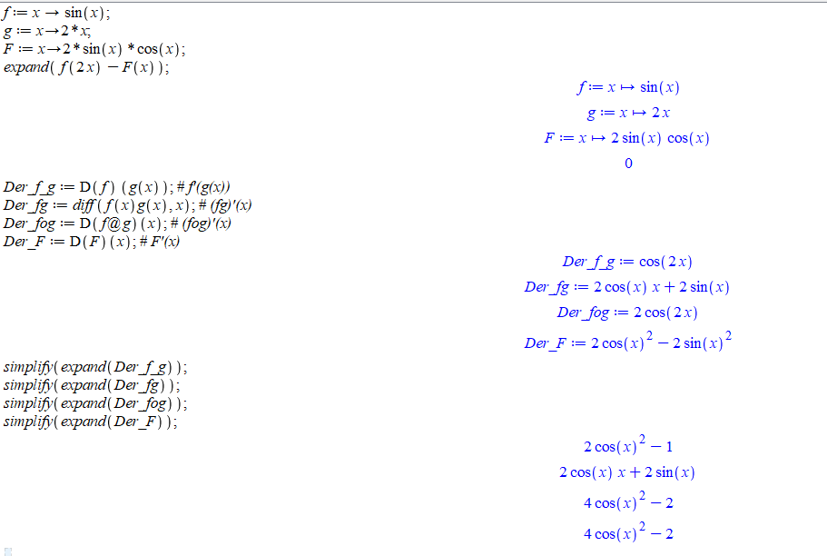
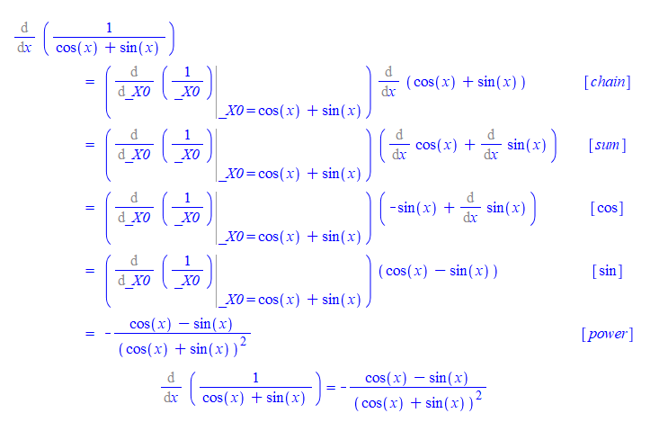

# Derivatives

## Derivative Functions

What makes derivative so important in modern mathematics is the ideal of linearly approximating curves using tangent lines. Geometrically, the derivative of a function $f$ at a point $x=a$ is the slope of the line tangent to $f$ at $x=a$. Using limits (if it exists), the derivative is defined as
$$
f'(a):=\lim\limits_{x\to a}\frac{f(x)-f(a)}{x-a}.
$$

Consider $a$ as a variable, we may define a function called the derivative function. In terms of limits, the derivative function of a function $f$, denoted by $f'$ is given by
$$
f'(x)=\lim\limits_{h\to 0}\frac{f(x+h)-f(x)}{h}.
$$

Using limit laws, we can show that differentiable functions are continuous.

Geometrically, the graph of differentiable function locally is flat without any hole or jump.

All [elementary functions](https://en.wikipedia.org/wiki/Elementary_function) are differentiable over their domain. But there are also many functions which are not differential everywhere in their domain.

```{example}

Use the graph of the function $f(x)=|x-1|$ to identify a $x$ value where $f$ is not differential. Verify your finding using the definition of differentiability.

```

```{solution}

First plot the function.

    f:= x-> abs(x)

    plot(f(x), x=-2..2)

You will see the function is not flat near $x=1$. To verify that, we calculate the limit of the difference quotient for all $x$ and then evaluate the resulting function at $x=1$.

    diffquot:=(f(x+h)-f(x))/h

    derlimit:= limit(diffquot, h=0)

    evalf(subs(x=1, derlimit))

```

```{exercise}

Determine whether the function
$$
f(x)=\begin{cases}
x\sin\left(\frac1x\right) & x\neq 0\\
0 & x=0
\end{cases}
$$
is differential at $x=0$ using the definition of the differentiability.

```

```{exercise}

Determine whether the function
$$
f(x)=\begin{cases}
x^2\cos\left(\frac1x\right) & x\neq 0\\
0 & x=0
\end{cases}
$$
is differential at $x=0$ using the definition of the differentiability.

```

```{exercise}

Using the definition to find the derivative for $y=\sin x$.

```

## Calculating Derivatives

Calculating a derivative in Maple is as easy as calculating a limit. The command for differentiation is `diff(function, variable)`. For higher derivatives, you may simply repeat the variable or use `[variable$n]` to indicate the $n$ times differentiation.

```{example}

Calculate the first derivative and the second derivative for the function
$$
f(x)=\frac{2}{\sqrt{2\sin^2 x + 1}}.
$$

```

```{solution}

First represent the function rule simply by `f`.

    f:=2/(sqrt(2*(sin(x))^2+1))

Calculate the first derivative and denote the derivative by `f1`.

    f1:=diff(f, x);

Calculate the second derivative and denote the derivative by `f2`. You may use one of the following three commands.

    f2:=diff(f1, x)
    f2:=diff(f, x, x)
    f2:=diff(f, [x$2])

```

Maple also has a tutoring command for differentiation: `DiffTutor(function, variable)` which is again supported by the subpackage `Student[Calculus1]`. However, `DiffTutor` only works for the first derivative.

```{example}

Calculate the derivative for $g(x)=\frac{x^2-2x-x^{-3}}{\sqrt{x}}$ by hand and compare your calculation the the result given by `DiffTutor`.

```

```{solution}

By hand, we may simplify the expression using rational exponents first and then apply derivative rules.
$$
g'(x)=(x^{\frac32}-2x^{\frac12}-x^{-\frac72})'=\frac32\sqrt{x}-\frac{1}{\sqrt{x}}+\frac{7}{2x^4\sqrt{x}}=\frac{3x^5-2x^4+7}{2x^4\sqrt{x}}.
$$

To see the result from `DiffTutor`, we use the following command. Remember to load the `Student[Calculus1]` first.

    with(Student[Calculus1])
    DiffTutor((x^2-2*x-x^(-3))/sqrt(x), x)

Here is how does the output look like


```

```{exercise}

Calculate the first derivative for the function $y=2x^{-1}-3\sqrt{x}$ by hand and by Maple. Compare two results. Are they different? If so, can you explain the difference?

```

```{exercise}

Calculate the first derivative for the function $y=x\sin^{-1}(x)$ by hand and by Maple. Compare two results. Are they different? If so, can you explain the difference?

```

```{exercise}

Calculate the first derivative for the function $y=\frac{\cos(x)+\sin x}{x}$ by hand and by Maple. Compare two results. Are they different? If so, can you explain the difference?

```

```{exercise}

Calculate the $3$-th derivative for the function $y=\sin x\cos x$ by hand and by Maple. Can you find a formula for the $n$-th derivative of the function?

```

## Chain Rule

Let $f(x)$ and $g(x)$ be two differentiable functions. Then the derivative of the composite function $f(g(x))$ can be calculated using the following formula
$$
(f(g(x)))'=f'(g(x))g'(x).
$$
Why there is an extra factor $g'(x)$? This is mainly because $g(x+h)\approx g(x)+g'(x)h$.
<!-- More precisely, let
$$
\varepsilon(y, t)=\frac{f(y+t)-f(y)}{t}-f'(y).
$$
Then $f(y+t)-f(y)=t(f'(y)-\varepsilon(y, t)$, $\varepsilon(y, t)$ is a continuous function in $t$ for each fixed value $y$, and $lim\limits_{t\to 0}\varepsilon(y, t)=0$ for every fixed $y$.
Now let $y=g(x)$ and $t=g(x+h)-g(x)$. Then
$$
\lim_{h\to 0}\frac{f(g(x+h))-f(x)}{h}=\lim_{h\to 0}\frac{g(x+h)-g(x)}{h}(f'(g(x))-\lim_{h\to 0}\varepsilon(g(x), (g(x+h)-g(x)))=f'(g(x))g'(x).
$$ -->

Now let's use Maple to understand the chain rule. In Maple, the symbol for composition is `@`, that is, in Maple the composition $f\circ g$ is given by `f@g`.

Since we will evaluate derivative functions, in addition to the command `diff(expression, variable)`, we will also use `D(function)(variable)` to find the derivative function. One major difference between those two commands is that `D` is designed to differentiate functions, whereas `diff` is for differentiating expressions.


```{example}

Let $f(x)=\sin x$, $g(x)=2x$ and $F(x)=2\sin x\cos x$. Find $f'(g(x))$, $(fg)'(x)$, $(f\circ g)'(x)$ and $F'(x)$?
Compare the derivatives and draw a conclusion.

```

```{solution}

We first define the functions.

    f:=x->sin(x);
    g:=x->2*x;
    F:=x->2*sin(x)*cos(x);

Find the derivative functions

    Der_f_g:=D(f)(g(x)); # f'(g(x))
    Der_fg:=diff(f(x)g(x), x); # (fg)'(x)
    Der_fog:=D(f@g)(x); # (fog)'(x)
    Der_F:=D(F)(x); # F'(x)

To compare the derivatives, we use the command `expand` and `simplify` to rewrite the expressions.

    simplify(expand(Der_f_g));
    simplify(expand(Der_fg));
    simplify(expand(Der_fog));
    simplify(expand(Der_F));

From the outputs, we see that $(f\circ g)'(x)=F'(x)$. Why they are the same? This is because $\sin(2x)=2\sin x\cos x$!.



```

```{remark}

You may also use `D(unapply(f(x)*g(x), x))(x)` to calculate the derivative of the product function $(fg)(x)=f(x)g(x)$.

```

The chain rule is almost unavoidable in calculation of derivatives. Sometimes, using chain rule will simplify the calculation.

```{example}

Consider the function $f(x)=\frac{1}{\sin x+\cos x}$.

1. Find the derivative function $f'(x)$ using `DiffTutor`. Which rule of derivative was applied first?
2. Find the point where the tangent line of $f$ is horizontal over the domain $(-\frac{\pi}{2}, \frac{\pi}{2})$.
3. Find an equation of the tangent line at $(0, 1)$.
4. Plot the tangent line and the function together over the domain $(-\frac12, \frac12)$.

```

```{solution}

You may use quotient rule to find the derivative. However, the chain rule may be a better choice because $\frac{1}{\sin x+\cos x}=(\sin x+\cos x)^{-1}$. Let's try `DiffTutor`.

    restart; # Use `restart` to clear the internal memory.
    with(Student[Calculus1]);
    f:=1/(sin(x)+cos(x));
    DiffTutor(f, x);

You see that the chain rule was applied first.



To find the points where the tangent line is horizontal, we need to solve the equation $f'(x)=0$.

    solve(diff(f, x)=0)

To find the tangent line, we find the derivative $f'(0)$. One way is to use `unapply`.

    unapply(diff(f, x), x)(0)

You may also use `eval(expression, variable=value)`.

    eval(diff(f, x), x=0)

Since $f'(0)=-1$, the tangent line at $(0, 1)$ is defined by $y=-x+1$.

    y:= -x+1

Now let's verify visually that $y=-x+1$ is the tangent line.

    plot([f, y], x=-1/2..1/2)

```

```{exercise}

Let $f(x)=\sin x$, $g(x)=\frac{\pi}{2}-x$ and $h(x)=\cos x$. Find $f'(g(x))$, $(fg)'(x)$, $(f\circ g)'(x)$ and $h'(x)$. Compare the derivatives and draw a conclusion.

```

```{exercise}

Let $f(x)=x^2$ and $g(x)=\cos x$ and $h(x)=\frac{1}{2}(\cos(2x)+1)$. Find $f'(g(x))$, $(fg)'(x)$, $(f\circ g)'(x)$ and $h'(x)$. Compare the derivatives and draw a conclusion.

```

```{exercise}

Consider the function $F(x)=\sin^2(\frac{\pi(x^2+1)}{3})$.

1. Define three functions $f$, $g$ and $h$ so that $F(x)=f(g(h(x)))$.
2. Describe how the derivative function $F'(x)$ was calculated by `DiffTutor`.
3. Find the point where the tangent line of $F$ is horizontal over the domain $(0, 1)$.
4. Find an equation of the tangent line of $F$ at $(1, \frac34)$.
5. Plot the tangent line and the function together over the domain $(\frac12, \frac32)$.

```

## Implicit Differentiation

Implicit differentiation is an application of the chain rule. It provides a way to find the slope of a tangent line of a function implicitly defined by an equation, that is, the dependent variable is not isolated.

In Maple, there are two useful commands that help us understand implicit defined functions.
The command `implicitplot(equation, domain, range, options)` supported by the package `plots` can be used to graph an implicitly defined function.
The command `implicitdiff(function, dependent variable, independent variable)` can be used to find derivatives implicitly.

```{example}

Graph the function $y$ of $x$ defined by $x^2+2y^2=2x+4y$ with it tangent line at $(2, 0)$ over the domain $(1, 3)$ and range $(-1, 2)$.

```

```{solution}

Let's first assign an name to the equation. (Run `restart` first if `x` and `y` were previously used an names.)

    restart;
    eqnf:=x^2+2*y^2=2*x+4*y;

Now let's find the derivative function, and its value at $(0, 1)$.

    D_eqnf:=implicitdiff(eqnf, y, x);
    slope:=eval(D_eqnf, {x=2, y=0});

Let's define the tangent line

    tangentline:= y=slope*(x-2)+0

Now we are ready to plot the function with the tangent line together.

    with(plots);
    implicitplot([eqnf, tangentline], x=1..3, y=-1..2, color=[red, blue]);

```

```{remark}

Another way, which is more flexible, to put two or more graphs together is to use the command `display(graph1, graph2)` which is supported by the package `plots`. For example, the following commands will show two curves in a single picture.

    with(plots):
    g1 := implicitplot(x^2+y^2=1, x=-1..1, y=0..1):
    g2 := plot(1-abs(x), x=-1..1):
    display(g1, g2, title="Two Together");

Note that we use colone `:` at the end of a command to hide the output.

```

```{exercise}

For the ellipse $x^2-xy+y^2=4$, find the locations of all horizontal tangent lines and plot them implicitly on the same graph as the relation over the interval $-3 \leq x \leq 3$ and $-3 \leq y \leq 3$.

```

```{exercise}

Find an equation of the line tangent to the curve $x^2 + (x-y)^3 = 9$ at $x=1$. (You may want to use `solve` and `subs` to find the $y$ when $x=1$).

```

```{exercise}

Find all points $(x, y)$ on the curve of $|x|^{2/3} + |y|^{2/3} = 8$ where lines tangent to the curve at $(x, y)$ is perpendicular to the line $x-y=1$. (Use `?solve` to learn how to solve a system of equations in Maple).

```
## Rates of Change and Derivatives

Given a function $y=f(x)$, the average rate of change of $f$ is the difference quotient
$$
\frac{\Delta y}{\Delta x}=\frac{f(x+\Delta x)-f(x)}{\Delta x}.
$$
The instantaneous rate of change is the limit $\lim\limits_{\Delta x\to 0}\frac{\Delta y}{\Delta x}$ which is exactly the derivate of $f$. However, in science, economy and many other field, the same concept bears different names. For example, the velocity is the instantaneous rate of change of the position function; the marginal cost is the derivative of the cost function.

Now let's use Maple to help us understand such kind of application of derivatives.

```{example}

The position function of a particle moving along a straight line after $t$ seconds is $s(t)= 2t^3-6t^2-18t+1$ meters.

1. Find the time $t$ that the particle is at the rest.
2. Find the distance the particle moved in the first 5 seconds.
3. Plot the $s(t)$, $v(t)$ and $a(t)$ for $0\le t\le 5$ together.
4. When the particle is speeding up?
5. Confirm you answer in 3. using graph of the speed function.

```

```{solution}

Let's first define if position function

    s:= t->2*t^3-6*t^2-18*t+1

The particle at rest when the velocity is 0. To find $t$, we find $v(t)$ first and then solve $t$ from $v(t)=0$.

    v:=D(s);
    solve({v(t)=0, t>0}, t); # assuming t>0.

From the output, you will find that after 3 second the particle is temporarily at rest.

The particle moves forward if $v(t)>0$ and backward if $v(t)<0$. You may use the previous output or apply the command `solve` for those two inequalities. Either way, you will find from $t=0$ to $t=3$, $v(t)<0$ and $v(t)>0$ for $3<t\le 5$. So the total distance should be calculated as

    totdist:= abs(s(3)-s(0))+abs(s(5)-s(3))

The acceleration function $a(t)=v'(t)$. To plot those three functions together, you may use `plot`. 

    a:=D(v);
    plot([s(t), v(t), a(t)], t=0..5, color=[black, blue, red]);

The speed function of the particle is $|v(t)|$. When $v(t)>0$ and $a(t)>0$, the particle is speeding up. When $v(t)<0$ and $a(t)<0$, the particle is also speeding up. So the particle is speeding up if $v(t)a(t)>0$. Similarly, the particle is slowing down if $v(t)a(t)<0$.

     solve({v(t)*a(t)>0, t>0}, t)

It shows that the particle is speeding up when $t<1$ or $t>3$. This can also be seen from the graph of the speed function.

     plot(abs(v(t)), t=0..5)


```

```{exercise}

The position function of a particle moving along a straight line after $t$ seconds is $s(t) = t^3 - 6t^2 - 15t+2$ meters.

1. Find the time $t$ that the particle is at the rest.
2. Find the distance the particle moved in the first 5 seconds.
3. Plot the $s(t)$, $v(t)$ and $a(t)$ for $0\le t\le 5$ together.
4. When the particle is speeding up?
5. Confirm you answer in 3. using graph of the speed function.

```

```{exercise}

Suppose that the profit obtained from the sale of $x$ calculators is given by $P(x)=-0.05x^2+4x+25$. Use the marginal profit function to estimate the profit from the sale of the 51st calculator.

```

## Related Rates

Stewart suggests the following general steps for solving problems about related rates.

1. Read the problem carefully. (What quantities are known? What is the unknown rate of change?)
2. Draw a diagram if possible.
3. Introduce notations. Assign symbols to all quantities that are functions of time.
4. Express the given information and the required rate in terms of derivatives.
5. Write an equation that relates the various quantities of the problem. If necessary, use the geometry of the situation to eliminate one of the variables by substitution.
6. Use the Chain Rule to differentiate both sides of the equation with respect to  the shared independent variable, say $t$.
7. Substitute the given information into the resulting equation and solve for the unknown rate.

In Maple, the quantities that shared by the same independent variable should be written in function notations. See the following example for details.

```{example}

A spherical shaped balloon is inflated at a constant rate 2 cm$^3$/s. Find the relative rate growth of the diameter when its 10 cm wide.

```

```{solution}

The volume of a sphere is given by $V=\frac{4\pi}{3}r^3$. In this equation, both $V$ and $r$ are functions of the time $t$. In Maple, we will use `V(t)` and `r(t)` for the volume and the radius.

    eqn_v:=V(t)=4*Pi/3*(r(t))^3

We know that at a certain time $r(t)=10/2=5$, and $\frac{\mathrm{d}}{\mathrm{d} t}V(t)|_{r(t)=5}=2$. What is asked is $\frac{\mathrm{d}}{\mathrm{d} t}r(t)|_{r(t)=5}$. The two rates are related by the equation obtained by differentiating both side of the equation `eqn_v`.

    D_eqn_v:=diff(eqn_v, t)

In the above equation, we need to solve the derivative of $r$ with respect to $t$. Let's first simplify notations.

    D_v:=diff(V(t), t);
    D_r:=diff(r(t), t);
    D_r:=solve(D_eqn_v, D_r);

Now we plugin `D_v=2` and `r(t)=5` to find the value for `D_r`.

    subs({D_v=2, r(t)=5}, D_r) # or using eval(D_r, {D_v=2, r(t)=5})

```

```{exercise}

A cylindrical cup with radius 5 cm is being filled with coffee at a rate of 2 cm$^3$/s. How fast is
the height of the coffee increasing?

```

```{exercise}

Two cars start moving from the same point. One travels north at 30 mph and the other travels
west at 50 mph. At what rate is the distance between the cars changing one hour later?

```

```{exercise}

Sands dumping from a truck to the ground at a constant rate 5 m$^3$/s is creating a circular cone. Find a relation between the rate of growth of the radius of the base and the rate of growth of the height of cone, when the the base is 6 m and the heigh is 4 m.

```

## Linearizations

Let $f$ be the function differentiable at $x = a$. The **linearization** of $f$ at $x = a$ is defined to be the function $L(x)=f'(a)(x-a)+f(a)$. For any value $b$ near $a$, the function value $f(b)$ is approximately the same as $L(b)$. This method is called **linear approximation**. The tangent line approximation is fundamental to almost every application of the derivative.

```{example}

Find the linearization $L(x)$ of the function $f(x) = \sqrt[3](x+7)$ at $x=1$ and use this linearization to estimate $f(0.99)$. How large is the error?

```

```{solution}

We first find the slope fr the linearization which is the derivative $f'(1)$.

    f:=x->surd(x+7, 3); # or f:=x->(x+7)^(1/3)
    m:=simplify(D(f)(1)); # this is the slope (simplified).

Now we define the linearization $L(x)$ and estimate $f(0.99)$ using $L(0.99)$.

    L:=x->m*(x-1)+f(1);
    L(0.99);

The error may be calculated based on the output of the follow command.

    f_L:=f(0.99)-L(0.99);

The results shows that the linear approximation is slightly over estimated with an error less than $4\times 10^{-7}$.

```

```{exercise}

Find the linear approximation $L(x)$ of the function $f(x) = \frac{\sqrt{x}}{x+1}$ at $x = 1$. Use this linearization to approximate $f(1.02)$.

```

```{exercise}

Find the linear approximation $L(x)$ of the function $f(x) = \cos(2x)$ at $x = 0$. Use this linearization to approximate $f(0.1)$.

```

```{exercise}

Find the linear approximation $L(x)$ of the function $f(x) = \sqrt{x^2+5}$ at $x = 2$. Use this linearization to approximate $f(2.03)$.

```

## Newton's Method

In science and engineering, many problems may be eventually reduced to nonlinear equations which likely has no algebraic (analytic) solution. In such a situation, numerical solutions are hoped for applications. We've seen a method to find a numerical solution using the intermediate value theorem. However, it is not very effective. Using linearization, a root-finding algorithm was developed by Newton and other mathematicians. The idea is to use the $x$-coordinates of tangent lines to approximate a root of an equation. Let's see an example first using the Maple command `NewtonsMethod(function, starting point, options)` which is again supported by the subpackage `Student[Calculus1]`.

```{example}

Starting at $x=-1.5$, obtain a solution of $\sin x-\frac{x}{2}=0$ by Newton's method.

```

```{solution}

First load `Student[Calculus1]` use `with()`.

    with(Student[Calculus1])

Now apply the `NewtonsMethod command`

    NewtonsMethod(sin(x)-x/2, x=-1.5)

To see the graph, you may add the option `output=plot`.

    NewtonsMethod(sin(x)-x/2, x=-1.5, showroot=true, output=plot)

```

How does Newton's methods work? It's an iteration process. Consider the equation $f(x)=0$. Suppose $f$ is differentiable. To find a solution, we pick an initial value $x_0$ first. The $x$-value $x_1$ of the $x$-intercept of the linearization $L_0(x)=f'(x_0)(x-x_0)+f(x_0)$ should produce a value that is closer. The value $x_1$ is given by the formula
$$
x_1=x_0-\frac{f(x_0)}{f'(x_0)}.
$$
Iteratedly applying the above idea, we get the iteration formula
$$
x_{n}=x_{n-1}-\frac{f(x_{n-1})}{f'(x_{n-1})}.
$$

```{remark}

How many times should be iterated? It depends on the sizes of acceptable errors and a maximum number of iteration.

If the $x$-values produced from two successive iterates is sufficiently small, say $|x_n-x_{n-1}|<e_1$, and the function value at  $x=x_n$ is sufficiently small, say $f(x_n)<e_2$, where $e_1$ and $e_2$ are acceptable errors, then we may say $f(x)=0$ has a solution at $x=x_n$.

If after iterated a maximum number of times and a solution was not found, then we may have to change the initial value or using other methods.

If it happens that $f'(x_n) = 0$, then the iteration process fails.

The above algorithm may be realized using the following Maple codes.

    tol := 10^(-3);
    N := 100;
    f := x -> sin(x) - 1/2*x;
    m := D(f);
    newton := x -> evalf(x - f(x)/m(x)); # Newton's formula
    x := -1.5;

    for i to N do
      x := newton(x);
      if abs(x - newton(x)) < tol and abs(f(x)) < tol then
        break;
      eli i = N then
        error "Newton's method did not converge";
      end if;
    end do;

    print(x);

If you don't want to check the size of error, the code can be simplified using the composite symbol `@` in Maple.

    restart;
    f := x -> sin(x) - 1/2*x;
    m := D(f);
    newton := x -> evalf(x - f(x)/m(x));
    N:=100
    x[N]:=evalf((newton@@N)(-1.5)); # @@N means that newton compose with itself N times.

```

```{exercise}

Using Newton's Method to find solutions of the polynomial equation $x^3-x^2+1=0$.

```

```{exercise}

Using Newton's Method to find solutions of the equation $\cos x=\frac{x}{2}$.

```

```{exercise}

Using Newton's Method to find the solution of the equation $\tan x-2x=0$ in the interval $[1, 2]$. Among 1 and 2,which is a better initial value? Why?

```
