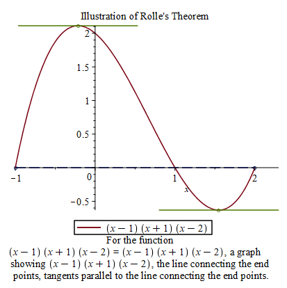
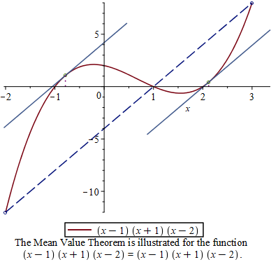
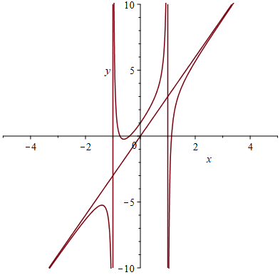

# Application of Differentiation

## Maximum and Minimum Values

If $f$ is continuous on a closed interval $[a, b]$, then $f$ attains an absolute maximum value $f(c)$ and an absolute minimum value $f(d)$ at some numbers $c$ and $d$ in $[a, b]$.

A **critical value** of a function $f$ is a number $c$ in its domain such that either $f'(c)=0$ or $f'(c)$ does not exist.

To find the absolute maximum and minimum values of $f$ over $[a,b]$, we do the following.

1. Find the values of $f$ at the critical values in $[a, b]$.
2. Find the values of $f(a)$ and $f(b)$.
3. The largest of the values from Steps 1 and 2 is the absolute maximum value; the smallest of these values is the absolute minimum value.

To find critical values, we solve the equation $f'(x)=0$ and look at where $f'(x)$ is undefined. In Maple, you can use the command `CriticalPoints(function, variable)` which is supported by the subpackage `Student[Calculus1]`.

```{example}

Find the absolute maximum and minimum values of the function $f(x)=|x^2-2x-3|$ over the interval $[0, 4]$.

```

```{solution}

First defined the function.

    f:=x->abs(x^2-2*x-3)

Find critical points.

    with(Student[Calculus1]):
    Cpts:=CriticalPoints(f(x), x);

Let's put endpoints and critical points in $[0,4]$ in a list.

    lst:=[op(remove(c->c<0 or c>4, Cpts)),0,4];
    # The op function extracts elements from the list.
    # The remove function removes removes the elements of Cpts in [0,4]
    # The remove function use a Boolean-valued procedure as a condition.
    # A procedure can be considered as a function. This is why we use ->. 

Evaluate the function at each point in the list.

    fc:=f~(lst) # ~ is the element-wise operator.

Find the maximum and minimum.

    fmax:=max(fc);
    fmin:=min(fc);

You may use the following code to display at where the function reaches an extremum.

    for c in lst do
        if f(c) = fmax then print(The maximum value of f(x) over [0, 4] is*%f(c) = fmax);
        elif f(c)=fmin then print(The minimum value of f(x) over [0, 4] is*%f(c) = fmin);
        end if;
    end do;

```

```{remark}

The above solution is still the method using Calculus but with the assistant of Maple. Indeed, Maple has the commands `maximize(f(x), x=a..b)` and `minimize(f(x), x=a..b)` which produce the maximum and minimum of a function $f(x)$ over an interval $[a,b]$.

```

```{exercise}

Find the absolute maximum and minimum values of the function $f(x)=x^3-3x+1$ over the interval $[0, 2]$.

```


```{exercise}

Find the absolute maximum and minimum values of the function $f(x)=2\cos x - x -1$ over the interval $[-2, 1]$.

```

## The Mean Value Theorem

Rolle's Theorem states that if a function $f$ is continuous on the closed interval $[a, b]$, differentiable on the open interval $(a, b)$ and $f(a)=f(b)$, then there exists a point $c$ in $(a, b)$ such that $f'(c)=0$.

Using Maple, you can verify this theorem for a function $f$ graphically using the following command
`RollesTheorem(f(x), x = a..b)` which is supported by the subpackage $Student[Calculus1]$.

```{example}

Let $f(x)=(x-1)(x+1)(x-2)$. Graph the function $f(x)$ from $-1$ to $2$ indicate the points between $-1$ and $2$ where tangent line is horizontal. Find values $x=c$ in $(-1,2)$ at where the tangent line is horizontal.

```

```{solution}

Define the function.
    
    restart:
    f:=x->(x-1)*(x+1)*(x-2)

Now let's create the graph of the function and the horizontal tangent line.
    
    with(Student[Calculus1]):
    RollesTheorem((x-1)*(x+1)*(x-2), x = -1..2);



To find the values $x=c$. We solve the equation $f'(x)=0$.

    solve({D(f)(x)=0, x>-1, x<2}, x)

```
A generalization of Rolle's theorem is the Mean Value Theorem.

If a function $f$ is continuous on the closed interval $[a, b]$ and differentiable on the open interval $(a, b)$, then there exists a point $c$ in $(a, b)$ such that 
$$
f'(c)=\dfrac{f(b)-f(a)}{b-a}
$$
or equivalently,
$$
f(b)=f(a)+f'(c)(b-a).
$$
 
The subpackage `Student[Calculus1]` also provides a command `MeanValueTheorem(f(x), x = a..b)` to illustrate the Mean Value Theorem.

```{example}

Let $f(x)=(x-1)(x+1)(x-2)$. Graph the function $f(x)$ from $-2$ to $3$ indicate the points between $-2$ and $3$ where tangent line is parallel to the secant line passing through $(-2, f(-2))$ and $(3, f(3))$. Find the values $x=c$ where the tangent line is parallel to the secant line.

```

```{solution}

Define the function.
    
    restart:
    f:=x->(x-1)*(x+1)*(x-2)

Now let's create the graph of the function and the horizontal tangent line.

    with(Student[Calculus1]):
    MeanValueTheorem(f(x), x = -2..3);



Find the slope `msec` of the secan line.

    a:= -2;
    b:= 3;
    msec:=(f(a)-f(b))/(a-b);

Solve the equation $f'(x)=$`msec` for $c$.

    solve({D(f)(x)=msec, x>-2, x<3}, x)

```

Note that in Rolle's theorem and Mean Value Theorem, the continuity and differentiability conditions are crucial.

```{example}

Consider the floor function $f(x)=\begin{cases}1 & x<0\\ 2& x\ge 0\end{cases}$. Use a graph to show that there is no tangent line that is parallel to the secant line through $(-1, 1)$ and $(1,2)$.

```

```{solution}

First define the function.

    restart:
    f := x->piecewise(x<0, 1, 2);

Now let's find the second line.

    a := -1; # left endpoint
    b := 1; # right endpoint
    msec:=(f(b)-f(a))/( b-a ); # slope of secant line
    secline:=f(a) + msec*(x-a); # secant line

Plot the function and the secant line together.

    plot([f(x), secline], x=a..b, discont=true);

Now try the `MeanValueTheorem` command.

    with( Student[Calculus1] ):
    MeanValueTheorem( f(x), a..b );

```

```{exercise}

Let $f(x)=\cos x$. Graph the function from $-\frac{2\pi}{3}$ to $\frac{4\pi}{3}$ and indicate the points in $[-\frac{2\pi}{3}, \frac{4\pi}{3}]$ where the derivative $f'(x)$ is $0$. Find the tangent points where the slope of the tangent line is $0$.

```

```{exercise}

Let $f(x)=x^4-3x^2+1$. Graph the function $f(x)$ from $-1$ to $2$ indicate the points between $-1$ and $2$ where tangent line is parallel to the secant line passing through $(-1, f(-1))$ and $(2, f(2))$. Find the tangent points where the tangent line is parallel to the secant line.

```

```{exercise}

Consider the floor function $f(x)=|x|$. Use a graph to show that there is no tangent line that is parallel to the secant line through $(-1, 1)$ and $(2,2)$.

```

## Derivatives and the Shape of a Graph

Given a function $f(x)$, we know that $f(x)$ is increasing on an interval if $f'(x)>0$ on that interval and $f(x)$ is decreasing on an interval if $f'(x)<0$ on that interval. By Mean Value theorem, $f(x)$ is a constant on an interval if $f'(x)=0$ on that interval.

To determine over which interval a function $f(x)$ is increasing/decreasing, we need to find out the domain of $f'(x)$ and the critical points and then use test points to determine the sign of $f'(x)$. 

Using first derivative, we can test local extrema at critical points.

```{theorem}

Suppose that $c$ is a critical point of a continuous function $f$.

1. If $f'$ changes from positive to negative at $c$, then $f$ has a local maximum at $c$.
2. If $f'$ changes from negative to positive at $c$, then $f$ has a local minimum at $c$.
3. If $f'$ does not change signs at $c$, then $f$ has no local extremum at $c$.

```

Another method to determine local extremum is to use second derivative.

```{theorem}

Suppose $f$ is a twice differentiable function on an interval $I$.

1. If $f''>0$ over $I$, then $f$ is concave upward on $I$.
2. If $f''<0$ over $I$, then $f$ is concave downward on $I$.

```

Base on the observation on concavity, we have the following second derivative test.

```{theorem}

Suppose that $f''$ is continuous near $c$.

1. If $f'(c)=0$ and $f''(c)>0$, then $f$ has a local minimum at $c$.
2. If $f'(c)=0$ and $f''(c)<0$, then $f$ has a local maximum at $c$.

```

```{example}

Find local extrema, the intervals on which $f(x)=\frac{x}{x^2+1}$ is increasing or decreasing and the intervals on which $f(x)$ is concave up or concave down.

```

```{solution}

First we define the function and find the derivatives.
    f:=x->x/(x^2+1);
    df:=D(f);
    ddf:=D(D(f));

Now let's find critical points using `Student[Calculus1]` subpackage.
    with(Student[Calculus1]):
    CriticalPoints(f(x),x)

Find the intervals of monotonicity (using test points).

    df(t) # where t is a test point in an interval, you replace it by a number.

Determine local extrema and find values.

    g(c) # suppose c is a critical point.

Find critical points of the derivative function $g'(x)$ and determine intervals of concavity.

    CriticalPoints(df(x),x);
    ddf(t);     # evaluate the second derivative at a test point $t$.

From the outputs, we know that $f$ is decreasing on $(-\infty, -1)\cup (1, \infty)$ and increasing on $(-1, 1)$. It has a local minimum $f(-1)=-\frac12$ and a local maximum $f(1)=\frac12$.

The function is concave cup on $(-\sqrt{3}, 0)\cup (\sqrt{3},\infty)$ and concave down on $(-\infty,-\sqrt{3})\cup (0,\sqrt{3})$.

```

```{exercise}

Let $f(x)=\sin x+\cos x$ be a function defined over the interval $[0, 2\pi]$. Find local extrema,  the intervals on which $f$ is increasing or decreasing and the intervals on which $f(x)$ is concave up or concave down.

```

## Limits at Infinity and Asymptotes

Limits at infinity can provide information on the end behaviors of a curve such as horizontal and vertical asymptotes.

When the limit of a function is an infinite limits, we will get a vertical asymptotes.

The function $f$ has a horizontal asymptote $y = b$ if $\lim\limits_{x\to \infty}f(x)=b$ or $\lim\limits_{x\to -\infty}f(x)=b$.

The function $f$ has a horizontal asymptote $x = a$ if $\lim\limits_{x\to a^+}f(x)=\infty$, $\lim\limits_{x\to a^-}f(x)=\infty$, $\lim\limits_{x\to a^+}f(x)=-\infty$ or $\lim\limits_{x\to a^-}f(x)=-\infty$.

The function $f$ has a slant asymptote $y = mx + b$ if $\lim\limits_{x\to \infty}(f(x)-(mx+b))=0$ or $\lim\limits_{x\to -\infty}(f(x)-(mx+b))=0$.

For rational functions, we have the following results.
Suppose $p(x)=a_nx^n+\cdots +a_1x+ a_0$ and $q(x)=b_mx^m+\cdots +a_1x+ a_0$
$$
\lim\limits_{x\to \infty}\frac{p(x)}{q(x)}=
\begin{cases}
    0 & \text{if}~ n<m\\
    \frac{a_n}{b_m} & \text{if}~ n=m\\
    \pm\infty & \text{if}~ n>m\\
\end{cases}
$$
In the last case, the sign agrees with the sign of $\frac{a_n}{b_m}$.

The limit at the negative infinity of a rational function is similar.

In Maple, to find limits, we use the command `limit(f(x), x=a)` or `LimitTutor(f(x), x=a)` supported by `Student[Calculus1]`. To find asymptotes, you may use the command `Asymptotes(f(x), x)` which is again supported by `Student[Calculus1]`.

```{example}

Evaluate the following limits.

1. $\lim\limits_{x\to \infty}\sqrt{x^2+1}$,
2. $\lim\limits_{x\to-\infty}\dfrac{x^3-1}{\sqrt{9x^6-x}}$
3. $\lim\limits_{x\to\infty}x\sin(\frac{1}{x})$.

```

```{solution}

Use `LimitTutor` to find limits step-by-step

    with(Student[Calculus1]);
    LimitTutor(sqrt(x^2+1), x=infinity);
    LimitTutor((x^3-1)/(9*x^6-x), x=-infinity);
    LimitTutor(x*sin(1/x), x=infinity);

```

```{example}

Find asymptote of the function $f(x)=\frac{x^{3}+2x^{2}-3x-1}{x^{2}-1}$ and plot the graph of $f$ and its asymptotes together with $x$ in $[-5,5]$ and $y$ in $[-10, 10]$.

```

```{solution}

Define the function first.

    restart:
    f:=x-> (x^3+2*x^3-3*x-1)/(x^2-1);

Find and plot asymptotes. Here, it's better to use `implicitplot` because vertical asymptotes are not functions of $x$.

    with(Student[Calculus1]):
    asym := Asymptotes(f(x), x);
    with(plots):
    asymplots := implicitplot(asym, x = -5 .. 5, y = -10 .. 10):

Plot the function $f$ and use `display` to put the graph and asymptotes together.

    Grphf:=plot(f(x), x=-5..5, y=-10..10, discont=true):
    display(asymplots, Grphf); # display is supported by the plots package.


```


```{exercise}

Evaluate the following limits.

1. $\lim\limits_{x\to \infty}\sqrt{x}\sin(\frac{1}{x})$,
2. $\lim\limits_{x\to-\infty}\dfrac{\sqrt{9x^6+1}}{x^3+x}$.

```

```{exercise}

Find asymptote of the function $f(x)=\frac{2x^{3}-3x^{2}-5x+2}{x^{2}+1}$ and plot the graph of $f$ and its asymptotes together with $x$ in $[-5,5]$ and $y$ in $[-10, 10]$.

```

```{exercise}

Find asymptote of the function $f(x)=\frac{8\sin x}{x^{2}+1}+\frac{x^{2}-x}{x^{2}-1}$ and plot the graph of $f$ and its asymptotes together with $x$ in $[-10,10]$ and $y$ in $[-20, 20]$.

```


## Curve Sketching

To plot the graph of a function in maple, we simply use the command `plot(function, widows, options)`.

On the other hand, we can sketch the graph using calculus, more precisely, monotonicity, concavity, vertical asymptotes, horizontal asymptotes, periods, symmetries, local extrema, intercepts etc.  

```{example}

Sketch and plot the graph of the function $g(x)=\frac{2x+1}{x-2}$.

```

```{solution}

First define the function

    g:=x->(2*x+1)/(x-2)

Find the domain of the function.

    solve((x-2)!=0, x)

Find the $x$-intercepts.

    solve(g(x)=0, x)

Find the $y$-intercept

    g(0)

Check whether $x=2$, where the function is undefined, is a vertical asymptote.

    limit(g(x), x=2, left);
    limit(g(x), x=2, right);

Find horizontal asymptotes

    limit(g(x), x=infinity);
    limit(g(x), x=-infinity);

Then we find derivative functions.

    dg:=D(g);    # first derivative
    ddg:=D(dg); # second derivative

Find all critical points. This can be done by finding using the `Student[Calculus1]` subpackage.

    with(Student[Calculus1]):
    CriticalPoints(g(x),x);

Find the intervals of monotonicity (using test points).

    dg(t) # where t is a test point in an interval, you replace it by a number.

Determine local extrema and find values.

    g(c) # suppose c is a critical point.

Find critical points of the derivative function $g'(x)$ and determine intervals of concavity.

    CriticalPoints(dg(x),x);
    ddg(t);     # evaluate the second derivative at a test point $t$.

Sketch the graph using above obtained information and compare with Maple `plot` output.

    plot(g(x), x=a..b) # Plot the function in the window [a, b].

```

```{exercise}

Sketch and plot the graph of the function $h(x)=\frac{x-1}{x+2}$.

```

```{exercise}

Sketch and plot the graph of the function $g(x)=x\sqrt{4-x}$.

```

## Optimization Problems

To solve a optimization problem in Calculus, the key is to represent the quantity to be optimized by a function of other quantities and then find the extremum value using the extreme value theorem.

```{example}

Among rectangles with the same perimeter $16$ centimeters, there is one that has the largest area. Find the dimension of that rectangle.

```

```{solution}

Suppose the length is $x$ and the width is $y$. The area is a function of $x$ and $y$.

    A:=(x, y)->x*y;

We know that the perimeter is $16$ which provides a relation between $x$ and $y$.

    prm:=2x+2y=16;

Solve for $y$ and plug it in to the area function.

    wd:=solve(prm, y);
    y:=unapply(wd, x); # define y as a function of x
    Ar:=unapply(A(x,y(x)),x); # Translate the area function into a function of x.

To find the maximum area, you may use `maximize` or using the following commands. Note that $x>0$.

    Amx := max(Ar~(solve(D(Ar)(x) = 0, x))); # Find critical points, evaluate, and find the maximum.
    xvalue := solve(Ar(x) = Amx, x); # Find the length x such that the area is the largest. 
    yvalue := y(xvalue); # Find the width y such that the area is the largest.

```

```{exercise}

Find the rectangle with the minimal perimeter among rectangles with the area 36 square inches.

```

```{exercise}

Find the point on the parabola $y^2=2x$ that is closest to the point $(1, -4)$.

```

## Antiderivatives

An antiderivative of a function $f$ over an interval $I$ is any function $F$ such that $F'(x)=f(x)$ for all $x$ in $I$.

Antiderivatives are closely related to integration. In Maple, you may use `int(f(x), x)` or `IntTutor(f(x), x)` supported by `Student[Calculus1]` to find an antiderivative of $f(x)$.

```{example}

Find an antiderivative of the function $f(x)=x^3-\frac{1}{\sqrt{x}}$ by hand and by Maple respectively. Use `diff` to check your answer.

```

```{solution}

To find an antiderivative by hand, rewrite the function using negative rational exponent and apply the formula
$$
\frac{\mathrm{d}}{\mathrm{d}x}\left(\frac{1}{r+1}x^{r+1}\right)=x^r.
$$

In this question, an antiderivative is $F(x)=\frac14x^4-2\sqrt{x}$.

Define the function first.

    restart:
    f:=x->x^3-1/sqrt(x);

Find an antiderivative using `int` and using `IntTutor` for a step-by-step solution.

    F:=int(f(x), x); # may define a function using unapply(int(f(x), x), x).

    with(Student[Calculus1]):
    TutorF:=IntTutor(f(x), x);

Verify using `diff`.

    diff(F, x);
    diff(TutorF, x);

```

```{exercise}

Find an antiderivative of the function $f(x)=x^2-3+8\sin(x)$ by hand and by Maple respectively. Use `diff` to check your answer.

```

```{exercise}

Find an antiderivative of the function $f(x)=\frac{x^3-2x+1}{\sqrt{x}}$ by hand and by Maple respectively. Use `diff` to check your answer.

```

```{exercise}

Find **the most general antiderivative** of the function $f(x)=\tan x\sec x+1$ by hand and by Maple respectively. Use `diff` to check your answer.

```