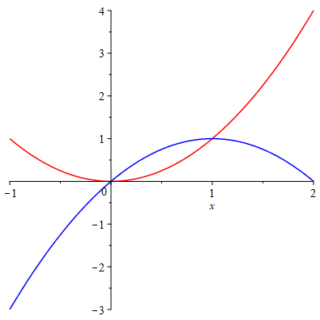

# Application of Integrals I

## Areas Between Curves

By the definition of integral, we see that the area between two curves, is the difference of areas "under" each curve. Here "under" is relative, it depends on how you slice the area.

If the slices are vertical, then the area between two curves $y=T(x)$ and $y=B(x)$ from $a$ to $b$ is given by
$$
\int_a^b|T(x)-B(x)|\mathrm{d} x.
$$

If the slices are horizontal, then the word "under" should be understood horizontally and the area between two curves $x=R(y)$ and $x=L(y)$ from $c$ to $d$ may be calculated by
$$
\int_c^d|R(y)-L(y)|\mathrm{d} y.
$$

Before you setup the interval, it's better to plot the curves first.

```{example}

Plot the curves $y=x^2$ and $y=2x-x^2$, and find the enclosed area

```

```{solution}

Define the functions.

    y[1]:=x->x^2:
    y[2]:=x->2*x-x^2:

Plot the curves and shade the enclosed area

    Curves:=plot([y[1](x), y[2](x)], x=-1..2, color=[red, blue])

{width=50%}

From the graph, we see the curves intersect at two points. Let's find the $x$-coordinates of the intersection points which are the integral limits.

    pts:=solve(y[1](x)=y[2](x), x)

Determine the upper and lower limits of the integral.

    a:=min(pts):
    b:=max(pts):

Setup the integral and evaluate

    Area:=Int(abs(y[1](x)-y[2](x)), x=0..1);
    ValArea:=value(Area);

```

```{example}

Find the area enclosed by the curves $y=x-1$ and $y^2=2x+6$. 

```

```{solution}

Note the second curve does not define a function of $x$. So let's just define the curves as equations.

    C[1]:=y=x+1:
    C[2]:=y^2=2x+6;

Plot the two curves use `implicitplot` which is supported by `plot`.

    with(plots):
    implicitplot([C[1],C[2]], x=-5..5, y=-5..5, color=[red, blue]);

{width=50%}

From the graph, we see that it's better to integrate along $y$-axis. So we need to solve for $x$ from the equations and view it as a function of $y$.

    x[1]:=unapply(solve(C[1], x), y);
    x[2]:=unapply(solve(C[2], x), y);

Find the $y$-coordinate of the intersection points and setup integral limits.

    ycord:=solve(x[1](y)=x[2](y), y);
    a:=min(ycord):
    b:=max(ycord):

Setup the integral with respect to $y$ and evaluate.

    Area:=Int(abs(x[1](y)-x[2](y)), y=a..b);
    ValArea:=value(Area);

```

```{exercise}

Find the area of the region bounded by  $y=\sin x$, $y=\cos x$, $x=0$ and $x=\pi/2$.

```

```{exercise}

Find the area between the curve $x=y^2-4y$ and $x=2y-y^2$.

```

```{exercise}

Find the area of the ellipse $\frac{x^2}{4}+\frac{y^2}{9}=1$.

```